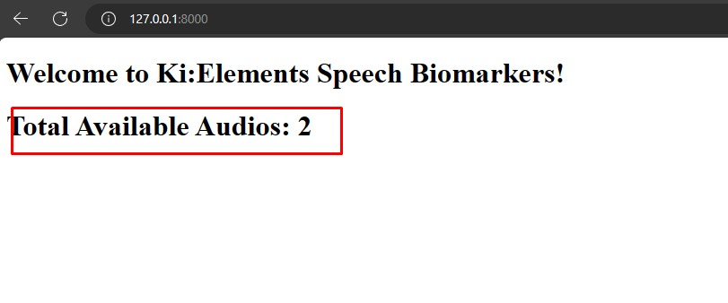
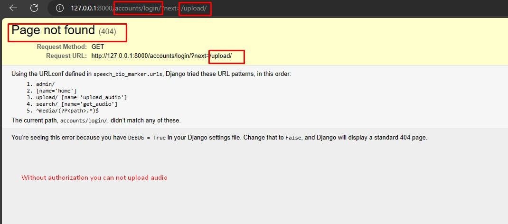
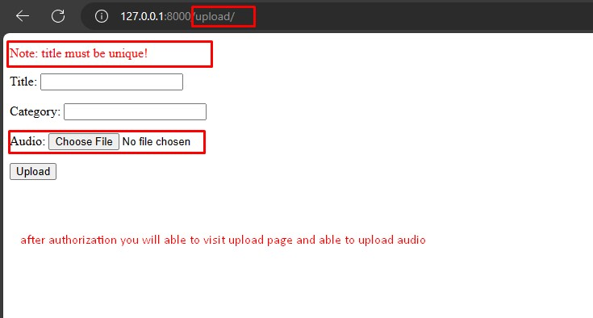
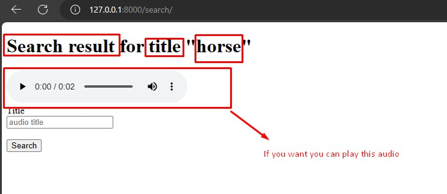
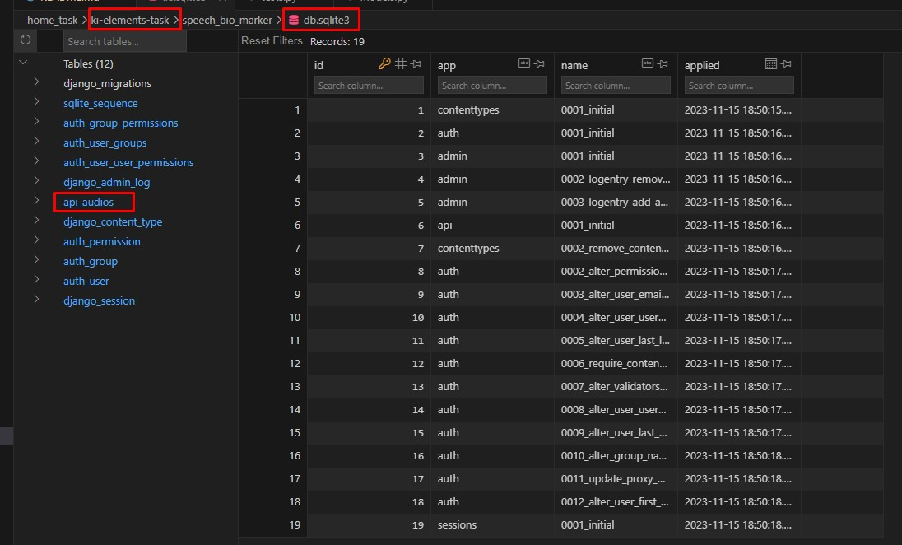
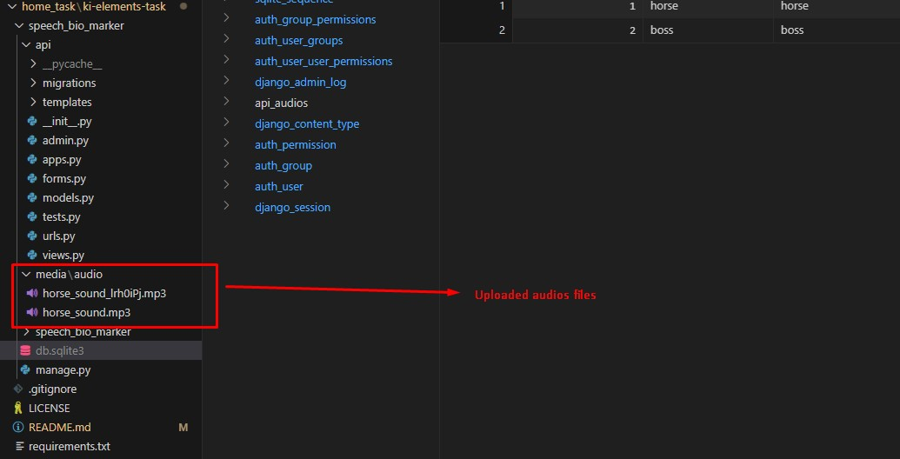
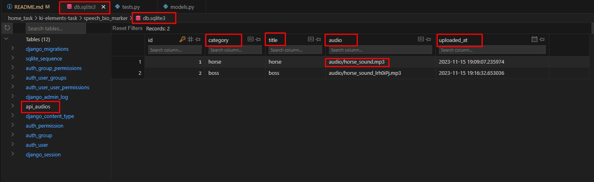
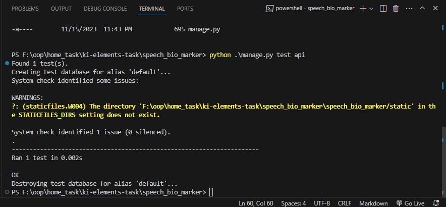

**ki-elements-task**

My Apology: I was outside and got this email letter. I am sorry that I submit lately. I took this challenge and done my task. I used django because in my first interview I completed one project with flask. Recently I learned Django and decided to done this task with Django. That's why i needed to read the documentation a lot. But ultimately I have done this project. By this task I tried to proof my strong willingness to learn new technology and my ability to take challenges and solve those challenges. And I wish I will get opportunity to learn more from your experienced team. I can assure you my utmost dedication 

**login credentials (since it is not production application so I am not worry about login credentials. That's why I provide credentials on GitHub)**

username = janna
password = janna

admin_login_link: http://127.0.0.1:8000/admin/

Without login you will able to see the index page. There you will find how many audios are avilable there. But If you want to listen the audio or want to upload new audio, you must have authorization. 

Also I used sqlite3 database. It's by default installed by django. So I decided to use this database. If you want to visualize the data in the sqlite3 db then you can install sqlite3 viewer extension on vs code. 

Although I created some html template. so you don't need to worry about those thing. I did this to test my api. you just need a single command python manage.py runserver. Then just visit http://127.0.0.1:8000 

1. If you want to upload audio then visit http://127.0.0.1:800/upload/
    Note: For upload audio you must have unique title. Because I used title as a search query. 

2. If you want to search audio then visit http://170.0.0.1:800/search
    a. If  your title is wrong it will redirect you to upload page. 

    b. If your title is right then It will show you the audio. you will able to run this audio. It's fun! isn't it? 

## UNIT TEST ##
I was not good enough in Django Unittest. But I want to learn more. Yet I tried to test my models. Because It is very important. If something happen wrong with database that means It will fully crushed our application. That's why I tried to test the models.

test_command: python .\manage.py test api

## code review ##

summary: To write a clean and scallable code I would take care couple of things. From my analysis I found mainly three different operation in this code block.
1. Database management
2. Hashing
3. endpoint operation 

Note: Also I got some indentation error inside some function 

My suggestion: 
1. Move the database related task to a different file like database.py. You can implement a class like DB_Management and create necessarly methods. Then just import DB_Management 

2. Move the hashing functionality to a different file. like Hash.py and do the same thing like point 1. 

3. Move the endpoint task to a different file like endpoint.py 

Finally intregrate those three functionality in the main.py or app.py file whatever you want. I think my proposal is very efficient, scallable and It will reduce the manitainance time, cost and overall increase the productibity. Specially It will be very useful for beginners. 

** Some photos of this task below **
** In my system this project is perfectly worked what I expected. ** 

** finally unit test. **

